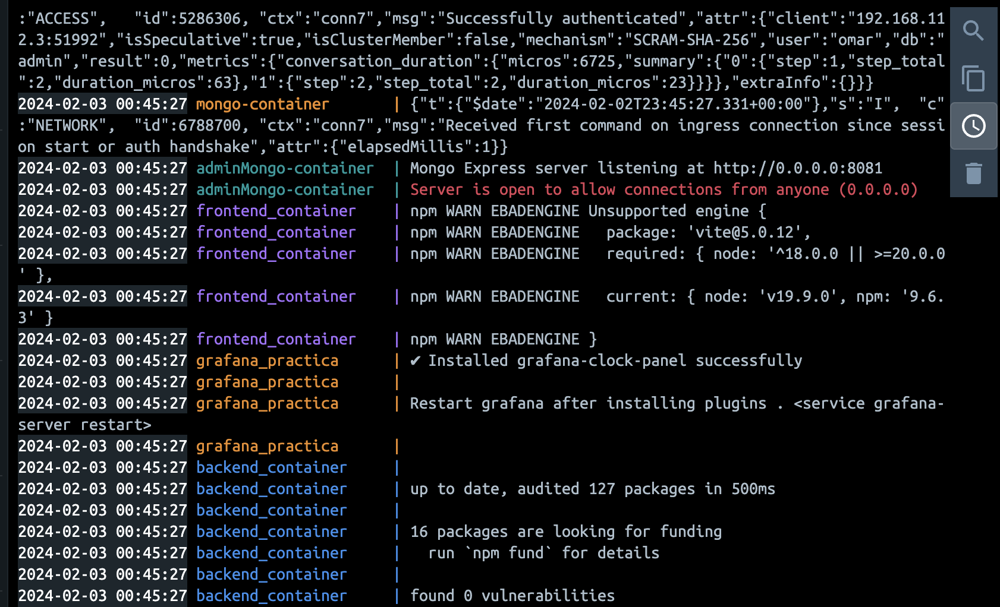
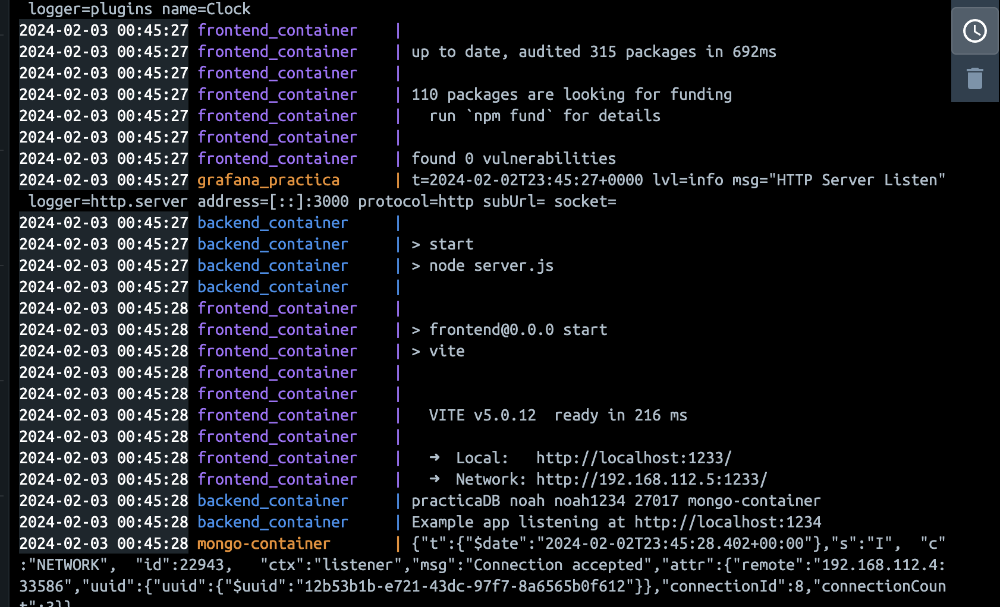
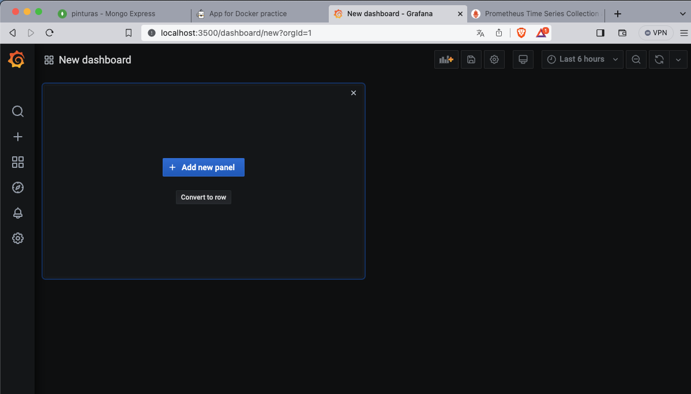
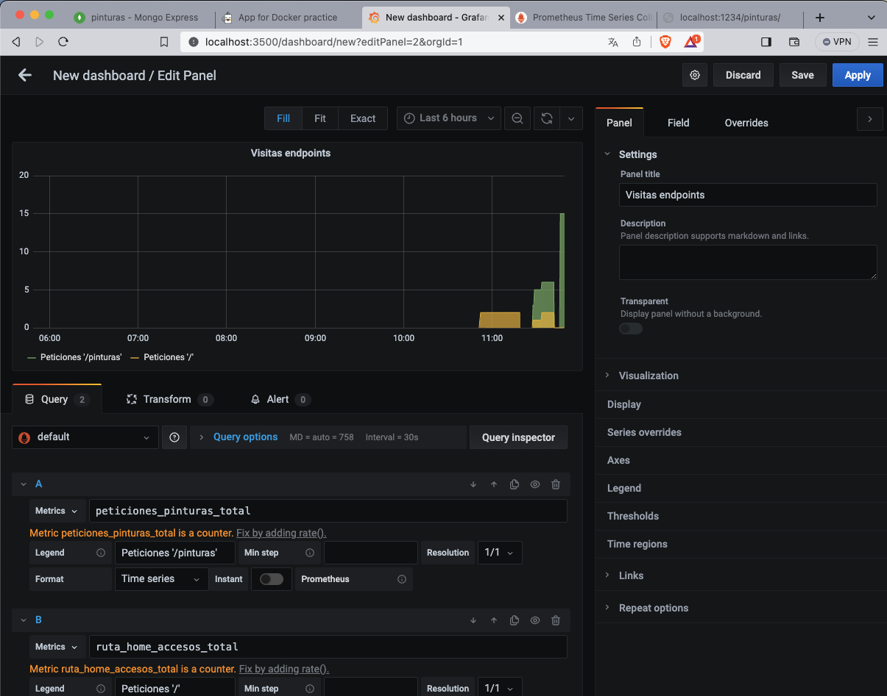
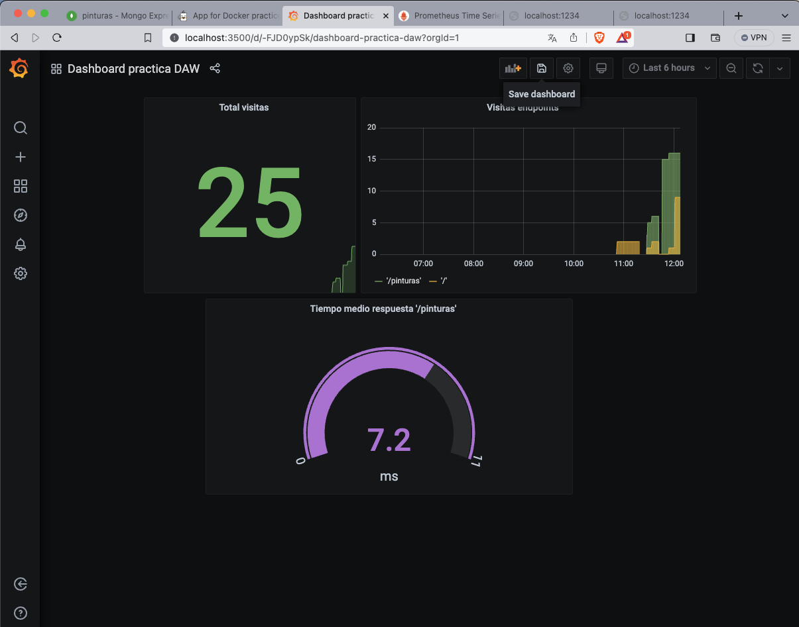
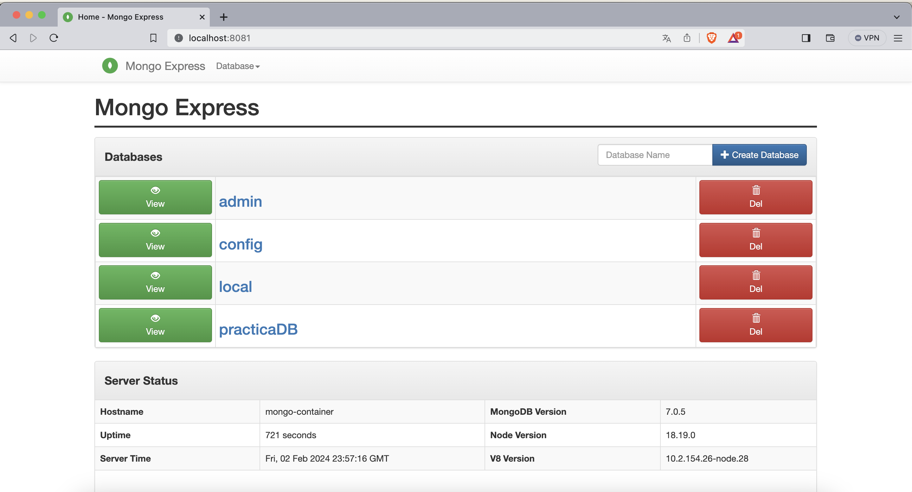

# INTEGRACIÓN EN DOCKER COMPOSE MULTIPLES SERVICIOS
### Backend, frontend, base de datos, loadbalancer y métricas

----


[MongoDB](#mongo-container)

Empezamos creando el ***docker compose*** por la parte de la base de datos y utilizaremos MongoDB. El docker compose lo contruimos de la siguiente manera:

#### MongoDB

~~~~yml
mongo-container:
    image: mongo:latest
    container_name: mongo-container
    restart: always
    ports:
      - ${MONGODB_PORT}:${MONGODB_PORT}
    environment:
      MONGO_INITDB_ROOT_USERNAME: ${MONGODB_ROOT_USER}
      MONGO_INITDB_ROOT_PASSWORD: ${MONGODB_ROOT_PASSWORD}
      MONGO_INITDB_DATABASE: ${MONGODB_NAME}
    hostname: mongo-container
    healthcheck:
      test:
        [
          "CMD",
          "mongosh",
          "--quiet",
          "127.0.0.1/mongo-container",
          "--eval",
          "'quit(db.runCommand({ ping: 1 }).ok ? 0 : 2)'",
        ]
      interval: 10s
      timeout: 10s
      retries: 5
      start_period: 20s
    volumes:
      - ./mongo/mongo-init.js:/docker-entrypoint-initdb.d/mongo-init.js:ro
      - ./mongo/mongodump.sh:/docker-entrypoint-initdb.d/mongodump.sh:ro
      - ./mongo/mongorestore.sh:/docker-entrypoint-initdb.d/mongorestore.sh
      - ./mongo/db-dump:/db-dump
    networks:
      - practica_net
~~~~

Utilizamos la imagen de mongo y según la documentación introducimos las variables de entorno correspondientes. Para poder iniciar el contenedor y que lo primero que haga sea crear las tablas y las rellene de datos tenemos 3 archivos.
El ***mongo-init.js*** con el que creamos la conexión a la base de datos **'practicaDB'**, nombre que le hemos dado en el docker compose, creamos un usuario, la colección y los datos a rellenar en ella.

~~~~~javascript
// Conexión a la base de datos
var conn = new Mongo();
var db = conn.getDB('practicaDB');

db.createUser(
    {
        user: "noah",
        pwd: "noah1234",
        roles: [
            {
                role: "readWrite",
                db: "practicaDB"
            }
        ]
    }
);

// Crear la colección
db.createCollection('pinturas');

// Documentos a insertar
var pinturas = [
    {
        "titulo": "La Gioconda",
        "autor": "Leonardo da Vinci",
        "anio_creacion": 1503,
        "descripcion": "La Mona Lisa es un retrato de Lisa Gherardini, esposa de Francesco del Giocondo.",
        "imagen": "https://upload.wikimedia.org/wikipedia/commons/thumb/6/6a/Mona_Lisa.jpg/800px-Mona_Lisa.jpg"

    },
    .
    .
    --> (los datos que queramos almacenar)<--
    .
    .
]
// Insertar documentos en la colección
db.pinturas.insertMany(pinturas);

print('Colección "pinturas" creada y documentos insertados exitosamente.');
~~~~~

Además, para realizar el dump de la base de datos nada más iniciar la base de datos tenemos el script ***mongodump.sh***. En él debemos introducir las variables de autentificación de la base de datos a la que realizar el dump. En nuestro caso, al ser las credenciales root, tenemos que poner la flag *--authenticationDatabase admin* y la ruta donde se almacenarán los archivos del respaldo realizado.

~~~~~sh
mongodump --authenticationDatabase admin --username omar --password omar1234 --db practicaDB --out /db-dump
echo "MongoDB dump hecho"
~~~~~

Por último, tenemos el script ***mongorestore.sh*** mediante el que restauraremos la base de datos cada vez que se inicie el contenedor en caso de ser necesario. Igual que el anterior script, lo unico que debemos indicar es la base de datos y la colección a restaurar con la flag *--nsInclude*.

~~~~~sh
mongorestore --authenticationDatabase admin --username omar --password omar1234 --nsInclude "practicaDB.pinturas" /db-dump
echo "MongoDB restore realizado
~~~~~

Estos tres archivos los debemos copiar en el directorio ***/docker-entrypoint-initdb.d/*** para que se ejecuten justo al iniciarse el contenedor. Importante también, referenciar el directorio donde se almacenará el dump.
Como hemos indicado, este contenedor deberá iniciarse el primero, ya que el resto dependen de alguna manera de este. Por ello, hemos creado un *healtcheck* para que una vez iniciado el servicio de mongo y este funcionando, pase a crearse el resto. Con las variables indicamos que se haga la primera comprobación a los 20s y que cada 10s se vuelva a comprobar en caso de fallo. Realizadas 3 comprobaciones fallidas, se interrumpe la inicialización del docker-compose.

##### Mongo Express.

Una vez creado el contenedor para del servicio de **MongoDB**, pasamos a configurar el de **Mongo Express**. A destacar las variables de entorno necesarias para vincular este contenedor con el de ***MongoDB*** (mongo-container en nuestro caso) y la propia configuración de ***Mongo Express***.

~~~~~yml
adminMongo-container:
    image: mongo-express:latest
    container_name: adminMongo-container
    restart: unless-stopped
    ports:
      - ${MONGO_EXPRESS_PORT}:${MONGO_EXPRESS_PORT}
    environment:
      ME_CONFIG_MONGODB_ADMINUSERNAME: ${MONGODB_ROOT_USER}
      ME_CONFIG_MONGODB_ADMINPASSWORD: ${MONGODB_ROOT_PASSWORD}
      ME_CONFIG_MONGODB_SERVER: mongo-container
      ME_CONFIG_MONGODB_PORT: ${MONGODB_PORT}
      ME_CONFIG_BASICAUTH_USERNAME: ${MONGO_EXPRESS_USER}
      ME_CONFIG_BASICAUTH_PASSWORD: ${MONGO_EXPRESS_PASSWORD}
      ME_CONFIG_MONGODB_URL: ${ME_MONGODB_URL}
    depends_on:
      mongo-container:
        condition: service_healthy
    networks:
      - practica_net
~~~~~

Hay que destacar con el *depends_on* incluyendo la *condition: service_healthy* la total dependencia con el contenedor de ***MongoDB***. Solo se inciará ***Mongo Express*** si ***MongoDB*** ha arrancado con éxito.

##### Backend.

Terminada la parte de la base de datos, pasamos al contenedor de backend. En nuestro caso, utilizamos utilizaremos ***NodeJS*** junto con ***Express*** y para ello el contenedor utiliza la imagen *node*.
Copiamos la carpeta local que contiene el proyecto de backend en el directorio de trabajo del contenedor. Una vez iniciado, ejecutamos el comando *npm install* y *npm start* para iniciar el servidor.
Una vez más, marcamos la dependencia a los servicios de ***MongoDB*** y ***Mongo Express***.

~~~~~yml
backend_container:
    image: node:19-alpine
    container_name: backend_container
    working_dir: /app
    command: sh -c "npm install && npm start"
    ports:
     - 1234:1234
    volumes:
      - ./backend:/app
    depends_on:
      - mongo-container
      - adminMongo-container
    networks:
      - practica_net
~~~~~

##### Frontend.

Iniciado el contenedor para nuestra API, es el turno del contenedor para el frontend. Utilizamos ***Vite*** y ***React*** con lo que volvemos a crear el contenedor con la imagen de *node*.
De nuevo, copiamos la carpeta que contiene el proyecto del frontend en el directorio del contenedor e inciamos tanto el instalador de paquetes como el servicio.

~~~~~yml
frontend_container:
    image: node:19-alpine
    container_name: frontend_container
    working_dir: /app
    command: sh -c "npm install && npm start"
    ports:
     - 1233:1233
    volumes:
      - ./frontend:/app
    depends_on:
      - backend_container
    networks:
      - practica_net
~~~~~

##### Prometheus.

En la parte de las métricas, utilizamos las imagenes de ***Prometheus*** y ***Grafana***.

~~~~yml
prometheus_practica:
    image: prom/prometheus:v2.20.1
    container_name: prometheus_practica
    ports:
    - "9090:9090"
    volumes:
    - ./prometheus/prometheus.yml:/etc/prometheus/prometheus.yml
    command:
    - --config.file=/etc/prometheus/prometheus.yml
    depends_on:
    - backend_container
    networks:
    - practica_net

  grafana_practica:
    image: grafana/grafana:7.1.5
    container_name: grafana_practica
    ports:
    - "3500:3000"
    volumes:
    - ./grafana/datasources.yml:/etc/grafana/provisioning/datasources/datasources.yml
    - myGrafanaVol:/var/lib/grafana
    environment:
      GF_AUTH_DISABLE_LOGIN_FORM: ${GF_AUTH_DISABLE_LOGIN_FORM}
      GF_AUTH_ANONYMOUS_ENABLED: ${GF_AUTH_ANONYMOUS_ENABLED}
      GF_AUTH_ANONYMOUS_ORG_ROLE: ${GF_AUTH_ANONYMOUS_ORG_ROLE}
      GF_INSTALL_PLUGINS: ${GF_INSTALL_PLUGINS}
    depends_on:
    - prometheus_practica
    networks:
    - practica_net
~~~~

Empezando por el servicio de métricas a incorporar en el servidor, debemos copiar el archivo de configuración de ***Prometheus*** en el directorio correspondiete del contenedor. Este archivo *prometheus.yml* contiene la información para que se conecte con el contenedor del backend *(backend_container)* y se inicia con el comando.

~~~~yml
global:
  scrape_interval: 5s
  evaluation_interval: 30s
scrape_configs:
  - job_name: "app nodejs express react. DAW final practice"
    honor_labels: true
    static_configs:
      - targets: ["backend_container:1234"]
~~~~

Para realizar unas métricas de prueba, hemos creado un contador de solicitudes para cada endpoint (*'/', '/pinturas'*) y un medidor de lo que tarda en realizarse el fetch de datos en nuestra API.

````javascript
// Contador para la ruta Home
const contadorRutaHome = new Counter({
    name: 'ruta_home_accesos_total',
    help: 'Número total de accesos a la ruta de ejemplo',
});

// Definir un contador para las peticiones a /pinturas
const contadorPeticionesPinturas = new Counter({
    name: 'peticiones_pinturas_total',
    help: 'Número total de peticiones realizadas a /pinturas',
});

// Definir métrica para el tiempo de respuesta de la petición a /pinturas
const tiempoRespuestaPeticion = new Gauge({
    name: 'ultimo_tiempo_peticion_ms',
    help: 'Tiempo de la última petición en milisegundos',
});
````

Una vez definidos, los inicamos en la url correspondiente y añadimos un endpoint para las métricas y ver que funciona.

~~~~javascript
app.get('/metrics', async (req, res) => {
    try {
        res.set('Content-Type', register.contentType);
        const metrics = await register.metrics();
        res.end(metrics);
    } catch (error) {
        console.error('Error retrieving metrics:', error);
        res.status(500).send('Error retrieving metrics');
    }
});

// Ruta HOME
app.get('/', (req, res) => {
    contadorRutaHome.inc();

    ... RESTO DE CODIGO ...
})

// Ruta para obtener las pinturas
app.get('/pinturas', async (req, res) => {
    const inicioTiempo = Date.now(); // Inicio de la petición
    contadorPeticionesPinturas.inc();
        try {
            const pinturas = await Pintura.find({});
            res.json(pinturas);
            const tiempoTotal = Date.now() - inicioTiempo; // Calculamos el tiempo entre el inicio de la peticion y cuando muestra los resultados
            tiempoRespuestaPeticion.set(tiempoTotal); // Actualiza el tiempo de la última petición
   
   ... RESTO DE CODIGO ...
        }
})
~~~~

##### Grafana.

Para configurar el servicio de ***Grafana*** de nuevo debemos intertar en el directorio correspondiente el archivo *datasources.yml*, insertar las variables de entorno y crear un volumen para mantener las metricas cuando se cierre y se vuelva a iniciar el contenedor.
~~~~yml
datasources.yml

apiVersion: 1
datasources:
  - name: Prometheus
    type: prometheus
    access: proxy
    orgId: 1
    url: prometheus_practica:9090
    basicAuth: false
    isDefault: true
    editable: true
~~~~

##### Loadbalancer.

Para finalizar con el ***docker compose***, configuramos un loadbalancer de nginx. Para ello, creamos el contenedor con la imagen nginx y copiamos el archivo nginx.conf en el directorio correspondiente del contenedor y una vez iniciado el contenedor que se ejecute el comando *nginx -g daemon off* para ejecutar nginx en primer plano.

~~~~yml
load_balancer:
    image: nginx:1.19.6
    container_name: load_balancer
    ports:
    - "80:80"
    volumes:
    - ./loadbalancer/nginx.conf:/etc/nginx/nginx.conf
    depends_on:
    - backend_container
    command: ["nginx", "-g", "daemon off;"]
    networks:
    - practica_net
~~~~

##### Arranque docker-compose.

Terminado el docker compose, lo arrancamos mediante *docker compose up --build* y vemos como arrancan todos los contenedores. Primero el de ***MongoDB*** y despues de unos 20s incian el resto.
Este es un ejemplo de como inician algunos de ellos.




En este paso, que ya han arrancado todos los contenedores. Tenemos que configurar el dashboard de ***Grafana***. En la url *localhost:3500*, nos aparecerá la pagina de bienvenida.

##### Configuración interfaz Grafana.



Hacemos click en el símbolo de + para crear un nuevo dashboard y en la siguiente pantalla, en la parte de abajo tenemos que activar las query de nuestros contadores.



En la barra de la derecha podemos personalizar el el gráfico a nuestro gusto.
Hemos creado 3 dashboards, uno con el contador de cada endpoit, otro de las visitas totales de los dos y el medidor de la respuesta del fetching. Nos queda un resultado como este:



##### Comprobación de todos los servicios.

Coprobamos que todos los contenedores funcionan correctamente.
Primero, el servicio de ***Mongo Express*** vinculado a ***MongoDB*** directamente.
Entrado en la url *localhost:8081*, vemos tanto la bd creada *('practicaDB')* como la colección *('pinturas)*




El siguiente contenedor a comprobar es el del backend, para ello en vez de entrar a *localhost:1234* donde tenemos nuestro servidor funcionando, lo hacemos con *localhost:80*. Esto es por tener funcionando el ***loadbalancer***.


Y si visitamos el endpoint de *('/pinturas)* nos devuelve el json de la base de datos.


En cuanto, al frontend, ingresamos a *localhost:1233* donde esta funcionando y nos muestra la aplicación de ejemplo creada con ***vite*** y ***react***.


Y si hacemos scroll vemos que la petición a la API funciona correctamente.


